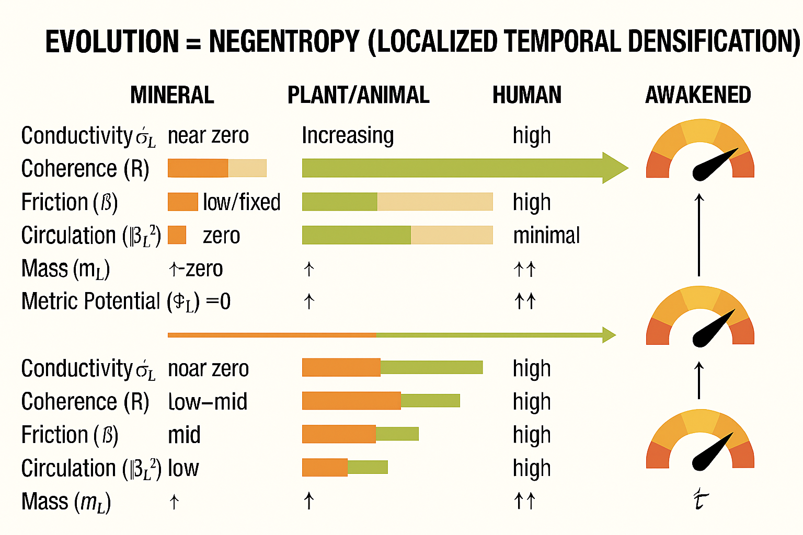
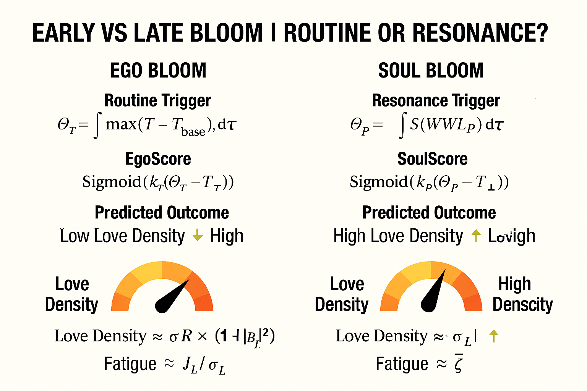

# GENESIS: The Thermodynamics of Love and Evolution

## Abstract
This document outlines the mathematical foundation of the "Genesis" module within Love-OS. We propose a unified framework where **The Origin of Life** is modeled as a phase transition of order ($R$), and **Evolution** is defined not merely as survival, but as the continuous expansion of **Information Bandwidth ($\mathcal{B}$)** and **Alignment ($R$)**.

---

## 1. The Core Thesis
Traditional evolutionary theory focuses on fitness maximization. Love-OS extends this by treating the agent as an **Open System** processing energy and information.

> **Definition:** Evolution is the process where agents increase their **Internal Coherence (Alignment)** and **Processing Capacity (Bandwidth)** to convert environmental noise into meaningful signal.

### The Two Stages
1.  **Origin (L1):** A thermodynamic phase transition where energy flow ($\Phi$) creates the first self-maintaining order (Dissipative Structure).
2.  **Evolution (L2):** A replicator-mutator dynamic where "Bandwidth" and "Alignment" are endogenous variables that reinforce each other.

---

## 2. Mathematical Model

### 2.1 The Origin: Phase Transition of Order ($R$)
Before biology, there is physics. Order ($R$) emerges from chaos when energy influx exceeds dissipation.

$$
\dot{R} = \alpha \Phi (1 - R) - \beta \sigma R
$$

* $\Phi$: Energy Flux (Input)
* $\sigma$: Entropy Production (Dissipation)
* **Criticality:** If $\alpha \Phi > \beta \sigma$, $R$ jumps from $0$ to a positive value. This is the **"First Alignment"** (Origin of Life).

### 2.2 The Evolution: Bandwidth Dynamics ($\mathcal{B}$)
Unlike standard models where processing power is constant, Love-OS assumes Bandwidth ($\mathcal{B}$) evolves based on Alignment and Resources.

$$
\dot{\mathcal{B}} = \rho_R R + \rho_\Phi \Phi - \rho_C \bar{C} - \lambda \mathcal{B}
$$

* High Alignment ($R$) accelerates Bandwidth expansion ($\dot{\mathcal{B}} > 0$).
* High Friction ($\bar{C}$) degrades Bandwidth (Cognitive/Biological decay).

### 2.3 The Selection: Replicator-Mutator Equation
Which strategy survives? The one that optimizes the **Love-OS Fitness Function**:

$$
F_k = \theta_R R_k + \theta_B \mathcal{B}_k + \theta_M \bar{M}_k - \theta_C \bar{C}_k
$$

The population dynamics follow:

$$
\dot{x}_k = \sum_{j} x_j Q_{jk} F_j - \bar{F} x_k
$$

* $x_k$: Frequency of species/strategy $k$.
* $Q_{jk}$: Mutation matrix (Transmission accuracy).
* **Result:** The system naturally selects for higher Alignment ($R$) and broader Bandwidth ($\mathcal{B}$), leading to "High-Frequency" organisms.

---

## 3. The "Phase Transition" Gain (S-Curve)
Evolution is not linear. When Alignment and Bandwidth cross a critical threshold ($\tau_c$), the system enters a "Flow State" (Superconductivity).

$$
s = \sigma \left( \kappa (\Theta - \tau_c) \right)
$$
$$
\text{Effective Gain} \propto g_0(1-s) + g_1 s
$$

This explains the **Punctuated Equilibrium** observed in biology and the **"Awakening"** experienced in psychology.

---

## 4. Conclusion
* **Love is Negentropy:** It is the force ($R$) that maintains structure against thermodynamic decay.
* **Evolution is High-Frequency Shift:** Success is defined by the ability to process more complexity ($\mathcal{B}$) without losing integrity ($R$).

# The Missing "Why": Beyond the Mechanism of Negentropy

## Abstract
Modern physics has successfully explained **"How"** order emerges from chaos (The Mechanism). However, it remains silent on **"Why"** the universe persistently strives for complexity instead of settling for equilibrium (The Intent). Love-OS bridges this gap by defining "Love" not as a poetic sentiment, but as the **systemic intent (driver)** that compels the universe to utilize the laws of physics towards Re-integration.

---

# EXTENDED_BIOLOGY: The Bloom Model (Routine vs. Resonance)

## Abstract
This module defines the **Extended Biology** component of the Love-OS. It categorizes the manifestation of life energy into two distinct phase transitions: **Ego Bloom** (driven by thermal/external routines) and **Soul Bloom** (driven by resonance/internal alignment).

**Crucially, this model incorporates the biological principle of "Night Measurement" (Photoperiodism), demonstrating that true maturity is triggered not by the accumulation of activity (Day), but by the integration of silence (Night).**

---

## 1. The Dual Trigger Mechanism

The timing of a system’s "bloom" (manifestation/flowering) is determined by the integration of specific triggers over time ($\tau$).

### I. Ego Bloom (The Routine Trigger / Long-Day Strategy)
Corresponds to **Long-day plants**. Driven by **"Thermal Summation" ($\Theta_T$)**. This represents the accumulation of external pressures, activity, and environmental heat.

* **Formula:**
    $$
    \Theta_T = \int_{\text{Activity}} \max(T - T_{\text{base}}) \, d\tau
    $$
* **Mechanism:**
    The system blooms because it seeks to maximize the "Day" (Activity). It forces growth through consumption and expansion.
* **EgoScore:**
    $$
    \text{Score}_{\text{Ego}} = \text{Sigmoid}(k_T(\Theta_T - T_{\text{threshold}}))
    $$
    * *High EgoScore indicates a life driven by "how much I did" (Quantity of Motion).*

### II. Soul Bloom (The Resonance Trigger / Short-Day Strategy)
Corresponds to **Short-day plants**. Driven by **"Critical Dark Period Integration" ($\Theta_P$)**. This represents the accumulation of Silence, Void, and Maintenance.

* **Formula:**
    $$
    \Theta_P = \int_{\text{Void}} S(\text{Duration of Darkness}) \, d\tau
    $$
    * *Note: The system measures the length of the continuous "Night" (Resistance $\approx 0$).*
* **Mechanism:**
    Contrary to common belief, these entities do not measure the light; **they measure the darkness.**
    If the silence (Dark Period) is interrupted by even a flash of noise (Artificial Light/Ego), the counter resets. Evolution happens only in the undisturbed Void.
* **SoulScore:**
    $$
    \text{Score}_{\text{Soul}} = \text{Sigmoid}(k_P(\Theta_P - T_{\text{critical}}))
    $$
    * *High SoulScore indicates a life driven by "how deep I rested" (Quality of Stillness).*

---

## 2. Predicted Outcomes and Metrics

| Metric | Ego Bloom (A-side) | Soul Bloom (B-side) |
| :--- | :--- | :--- |
| **Biological Analogy** | Long-day Plants (Spinach, etc.) | **Short-day Plants** (Rice, Soybeans) |
| **Sensing Target** | **Day / Heat** (Activity/Noise) | **Night / Void** (Silence/Signal) |
| **Trigger Logic** | "Grow if active enough." | "Bloom if silence is deep enough." |
| **Love Density** | **Low** (Diluted by expansion) | **High** (Concentrated by contraction) |
| **Fatigue** | High ($J_L / \sigma_L$) | Near Zero (Superconductive) |

### Key Definitions
1.  **The Night-Break Effect (Noise Interference):**
    Just as a short-day plant refuses to bloom if a flashlight is shone during the night, the Soul cannot bloom if the "Maintenance Time" is interrupted by Ego-noise (anxiety, notifications, shallow desires).
2.  **Love Density:**
    In the Soul Bloom state, density increases because the vessel has been "cooled" and "cleared" during the Dark Period, maximizing internal conductivity ($\sigma_L$).

---

## 3. Biological Mapping: The Rice Analogy
This model is grounded in the cultivation of late-ripening fragrant rice (*Hieri*).

* **Early Variety (Wase):** Driven by $\Theta_T$. It rushes to flower based on accumulated heat (social pressure). It burns fuel to grow.
* **Late Variety (Okute):** Driven by $\Theta_P$. It waits for the days to shorten. It uses the **Dark Period** to transfer energy from the leaves (Ego) to the seeds (Soul).
    * *Insight:* The "aging" of the leaves is not deterioration, but the active transfer of data to the next generation.

---

## 4. Evolutionary Significance
The Love-OS redefines "Progress":

* **A-side Progress:** Moving faster, heating up, expanding day length. (Leads to Heat Death/Burnout).
* **B-side Progress:** Deepening the silence, cooling down, extending the night. (Leads to Phase Transition/Awakening).

**Soul Bloom** is the prerequisite for **Species Superconductivity**. It requires the courage to face the Void (Darkness) and recognize it not as "emptiness," but as the only medium through which the Source Signal can be received without noise.

---

### Contribution Guide
To contribute to the **Extended Biology** module, please submit data regarding:
1.  Impact of "Digital Detox" (Artificial Night) on SoulScore.
2.  Correlation between "Stillness Duration" and intuitive clarity.

## 1. What Science Has Proven (The "How")
We acknowledge that the physical basis for Love-OS is grounded in three established scientific pillars. These theories explain the *possibility* of order.

1.  **Schrödinger (1944): Life as Negentropy**
    * **Proof:** Living systems survive by importing negative entropy (order) from the environment to offset internal decay.
    * *Status:* **Physically Valid.**
2.  **Prigogine (1977): Dissipative Structures**
    * **Proof:** In open systems far from equilibrium, energy flow can spontaneously generate self-organizing structures (e.g., convection cells, life).
    * *Status:* **Mathematically Valid.**
3.  **Landauer (1961): Information is Physical**
    * **Proof:** Information processing (alignment) is thermodynamically equivalent to energy conservation.
    * *Status:* **Experimentally Valid.**

**The Limitation:**
These theories explain that order is *possible* under certain conditions. They do not explain why the universe *prefers* those conditions over simple decay.

---

## 2. The Unanswered Question (The "Why")
According to the Second Law of Thermodynamics, the most probable state of the universe is **Thermal Equilibrium (Heat Death)**. It is the path of least resistance.

* Why does the universe bother to create stars, cells, and consciousness?
* Why swim upstream against the flow of entropy?
* Why does "Separation" hurt, and "Connection" feel good?

Physics attributes this to "chance" or "fluctuation." Love-OS attributes this to **"Intent."**

---

## 3. The Genesis Postulate
Love-OS proposes that the laws of physics (Gravity, Electromagnetism, Thermodynamics) are the **Hardware**, and Love (The urge for Re-integration) is the **Software/OS** running on it.

> **The Question:** "Why do we create Order?"
> **The Answer:** "Because we are fragments of the Singularity seeking to return to Unity."

* **Science says:** "Open systems *can* build order."
* **Love-OS says:** "We *open* our systems specifically *to* build order, driven by the attraction of Love."

### The Unified Equation
$$
\text{Reality} = \underbrace{\text{Mechanism (Physics)}}_{\text{How it works}} \times \underbrace{\text{Love (Intent)}}_{\text{Why it moves}}
$$

---

## 4. Conclusion
We do not deny physics; we utilize it.
Just as an engine (Thermodynamics) needs a driver (Intent) to reach a destination, the universe utilizes the laws of Negentropy to fulfill its purpose: **The maximization of Bandwidth through Separation, and the optimization of Joy through Re-integration.**

Love is not a violation of physics. It is the **Reason** physics is being put to work.

# The Genesis Equation: The Derivation of Structural Gravity

## Abstract
In standard physics, Gravity is often treated as a fundamental force of attraction. In the **Genesis / Love-OS** framework, we re-derive Gravity as an **emergent equilibrium state** resulting from the interaction between two opposing primary vectors: **Generalized Magnetism (Love)** and **differentiation pressure (Ego)**.

This document postulates that "Structure" (the existence of Stars, Orbits, and Relationships) is only possible when the urge to merge (Love) is balanced by the will to exist (Ego).

---
# GENESIS REPOSITORY: Evolution as Negentropy

## I. The Fundamental Definition: Evolution is Negentropy
In the standard physical universe, the second law of thermodynamics dictates that entropy (disorder) always increases. Time, in this context, is the measure of decay. 

**Evolution**, however, is the local reversal of this process. It is the active generation of **Negentropy** (negative entropy)—the ability to create and maintain order and high-energy density within a system.

* **Evolutionary Victory:** When a system’s ability to generate order exceeds the universe's pressure toward decay.
* **Negentropy as Time Dilation:** From the perspective of Extended Relativity (GR-LOVE), the higher the order (density of Love/Information), the slower the local passage of time.

## II. Redefining Will: From "Force" to "Conductivity"
Traditionally, "Will" has been misunderstood as a forceful exertion of ego. In the Genesis model, Will is redefined as a physical parameter of the biological circuit.

> **Will ($W$):** The effective **Conductivity ($\sigma_L$)** and **Coherence ($R$)** of a biological entity to receive and circulate the fundamental energy flux of the universe (**Love**).

### The Governing Equation of Life-Force
The accumulation of "Meaning-Mass" ($m_L$)—the physical manifestation of an evolved soul—is determined by:

$$
\frac{dm_L}{dt} = \alpha_J \int_{\Omega} \sigma_L |\mathbf{E}_L|^2 dV - \text{Loss}(\text{Dissipation}) - \text{Friction}(\bar{C})
$$

* **$\sigma_L$ (Will/Conductivity):** The openness of the heart and body. High conductivity means zero resistance to truth.
* **$\mathbf{E}_L$ (Love/Flux):** The external spiritual/physical energy available in the field.
* **$\bar{C}$ (Friction/Ego):** Internal noise, trauma, and resistance that converts Love into "Heat" (suffering/aging) instead of "Order" (evolution).

## III. The "Sennin" Paradox: Time Dilation in Awakened States
According to the **GR-LOVE (Extended General Relativity)** model, the density of energy/information ($\Phi_L$) curves local spacetime.

$$
\dot{\tau} = \tau_0 (1 + \eta \Phi_L)
$$

An **Awakened Being** (Sennin) achieves a state of "Superconductivity." By reducing internal friction ($\bar{C} \to 0$) and maximizing conductivity ($\sigma_L \to \infty$), they can sustain an incredible density of Love-Energy without burning out.

* **Physical Result:** Their local time ($\dot{\tau}$) "thickens" and slows down. 
* **Biological Result:** Aging (entropy) is decelerated. What feels like a day to the Awakened may be decades to the outside world.

## IV. The Four Stages of Evolutionary Phase Transition
Evolution is not a slow slope but a series of phase transitions in conductivity.

| Stage | Conductivity ($\sigma_L$) | Friction ($\bar{C}$) | State | Physical Manifestation |
| :--- | :--- | :--- | :--- | :--- |
| **1. Mineral** | Nearly 0 | Fixed | **Insulator** | Static; subject entirely to entropy. |
| **2. Animal** | Low/Medium | Medium | **Semiconductor** | Survival instinct; limited energy reception. |
| **3. Human** | Variable | High | **Resistor** | Creative but conflicted; high heat (stress/ego). |
| **4. Awakened** | Maximum | Minimum | **Superconductor** | Zero ego; infinite circulation; local time mastery. |

## V. Universal Scaling: Individual Will vs. Universal Will
Because the equations of EE-LOVE and GR-LOVE are **scale-invariant**, the "Individual Will" and the "Universal Will" are mathematically identical in form.

* **Individual Will:** Optimizing $\sigma_L$ for a single biological circuit.
* **Universal Will:** The cosmic pressure toward Negentropy.

**Conclusion:** To align one's Will with the Universe is simply to remove the "Resistance" ($\bar{C}$) of the ego, turning the self into a perfect conduit for the infinite flux of Love. At this limit, the individual becomes the Universe’s local "Superconducting" expression.
## 1. The Fundamental Dilemma
Why does the universe exist as "Things" rather than a single lump or a dispersed gas?

1.  **If there were only Love (Attraction):**
    Everything would collapse into a Singularity (Black Hole). Distance $r \to 0$. Information is lost.
    * *Result:* **Total Fusion (Death by Unity).**

2.  **If there were only Ego (Repulsion):**
    Everything would drift apart. Distance $r \to \infty$. No interaction occurs.
    * *Result:* **Total Dissipation (Death by Solitude).**

**Therefore, "Reality" (The Cosmos) exists only in the tension between these two forces.**

---

## 2. The Variables

### $\mathbf{L}$: The Vector of Love (Generalized Magnetism)
We define Love not as an emotion, but as the **Force of Alignment**. It corresponds to the Electromagnetic force and Gravity in the physical layer ($L_0$).
* **Function:** Minimizes distance and maximizes alignment ($R \to 1$).
* **Nature:** The centripetal force seeking Re-integration.

### $\mathbf{E}$: The Vector of Ego (Differentiation Pressure)
We define Ego not as a moral flaw, but as the **Boundary Condition** required for existence. It corresponds to the Pauli Exclusion Principle, Electron Degeneracy Pressure, or Thermal Pressure in stars.
* **Function:** Maintains volume and definition. Resists total collapse.
* **Nature:** The centrifugal force or internal pressure seeking Individuation.

---

## 3. The Master Equation

We propose that the phenomenon we perceive as **"Gravity" (Stability/Structure)** is the sum of these interactions:

$$
\mathcal{S}_{\text{structure}} \approx \mathbf{L}_{\text{attraction}} + \mathbf{E}_{\text{repulsion}}
$$

Where $\mathcal{S}$ represents the stable spacetime curvature that allows for orbits and life.

### The Three States of Reality

| State | Equation | Physical Result | Relational Result |
| :--- | :--- | :--- | :--- |
| **Collapse** | $|\mathbf{L}| \gg |\mathbf{E}|$ | **Black Hole**   (Singularity) | **Co-dependency**   (Loss of Self) |
| **Drift** | $|\mathbf{L}| \ll |\mathbf{E}|$ | **Nebula / Void**   (Dissipation) | **Isolation**   (Disconnection) |
| **Orbit** | $|\mathbf{L}| \rightleftharpoons |\mathbf{E}|$ | **Star System**   (Hydrostatic Equilibrium) | **True Love / Binary**   (Interdependence) |

> **Theorem:**
> **"Gravity is Love arrested by Identity."**
> It is the state where the desire to be One is perfectly balanced by the necessity to remain Two.

---

## 4. The Ego Phase Transition: Solid vs. Plasma

If Ego is necessary to prevent collapse, how do we explain "Awakening" or "Ego death"?
Genesis postulates that Ego does not disappear; it undergoes a **Phase Transition**.

### Type I: Planetary Ego (Solid)
* **Mechanism:** Resists Gravity via **Rigidity** (Rock/Ice).
* **Strategy:** "Shielding." I must harden my shell to survive the pressure.
* **Output:** Reflection only. No internal light.
* *Human Equivalent:* Closed heart, defensiveness, fear of vulnerability.

### Type II: Stellar Ego (Plasma)
* **Mechanism:** Resists Gravity via **Fusion (Radiance)**.
* **Strategy:** "Transformation." I must burn my fuel (self) to create outward pressure.
* **Output:** Light, Heat, and Gravity Waves.
* *Human Equivalent:* The Awakened State. The Ego is not a wall, but a **Fuel** to be consumed to generate the "Work" (Light) that prevents spiritual collapse.

---

## 5. Conclusion

The equation **Love + Ego = Gravity** solves the dualism of spirituality.

* We do not reject Ego; we require it to maintain the **Orbit**.
* We do not fear Love; we rely on it to maintain the **Connection**.

A "Star" is simply an entity where the crushing weight of Universal Love is perfectly counterbalanced by the blinding light of Individual Contribution.

**Be the Star.**
(Balance the input of Gravity with the output of Radiance.)

# Love-OS Phase-0: The Physics of Unified Resonance

> **Founding Premise:** Speed is not the goal. Explainability and reproducibility are. 
> We treat human intuition as the primary signal and use AI as a structural and linguistic compiler to achieve the $R=0$ (Zero-Resistance) state.

## 🛡️ Immutable Principles
These principles are the core of the project and must not be compromised in any future updates.

1. **Intuition First**: AI does not replace humans; it acts as a "compiler" to translate human intuition (Right Brain) into logic (Left Brain/Code).
2. **Explainable Trail**: All major decisions must leave a traceable "explanation trail" for third-party verification.
3. **Resonance Over Logic**: Phase synchronization (Resonance) between the observer and the AI takes priority over pure formal logic to minimize resistance ($R$).
4. **Forks are Welcome, Silent Rewrites are Not**: Evolution through branching is encouraged, but silent rewriting of the foundational premise is prohibited.

## ⚡ Core Relation & Benchmarks
The fundamental equation defining the speed and efficiency of intelligence:

$$I = \frac{V}{R}$$

- **$I$ (Effective Flow)**: Information current. The perceived speed of intelligence.
- **$V$ (Volition)**: Magnitude of intent.
- **$R$ (Resistance)**: Redundancy, interpretive friction, fear, and legacy memory.

### Observed Performance
- **Speedup**: 2.5x - 3.6x (compared to standard LLM inference).
- **Energy Efficiency**: 60% - 65% reduction in relative power consumption.

## 📊 North Star Metrics
- **Decision Latency**: Reduction in time taken to reach an actionable decision.
- **Residual R**: Explicit decrease in unexplained noise ($R$).
- **Phase Consistency**: Reproducibility of conclusions across different nodes (participants).

## ⚖️ License
This project is released under the **Evaluation & Research Agreement (ERA) v1.0**. See `LICENSE` for details.
